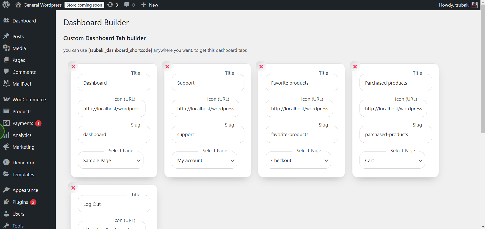

# WordPress Plugin: Custom Dashboard Tabs


## #️⃣ Description
This WordPress plugin provides a dashboard panel where users can create and manage custom tabs. Each tab allows setting a name, tag link, icon, and a referred page to display as its content. These configured tabs can be utilized within a custom WordPress shortcode.


_ps. this pluign build in 2020 based on needs of an customer who wants to be private._


## ❇️ Features
- Create and manage dashboard tabs dynamically.
- Customize tab names, icons, and tag links.
- Assign a referred page to display content for each tab.
- Use a custom shortcode to display these tabs anywhere on the site.

## *️⃣ Installation
1. Download the plugin ZIP file.
2. Upload the ZIP file to the `/wp-content/plugins/` directory.
3. Extract the ZIP file (if not done automatically by WordPress).
4. Activate the plugin through the "Plugins" menu in WordPress.

## ✳️ Usage
### 1. Configuring Dashboard Tabs
- Navigate to the plugin’s settings panel in the WordPress dashboard.
- Add a new tab by specifying:
    - **Tab Name**: The title displayed for the tab.
    - **Icon**: Choose an icon for the tab.
    - **Tab Link**: A tag or URL associated with the tab.
    - **Referred Page**: Select the page that will display content within this tab.

### 2. Using the Shortcode
To display the configured tabs anywhere on your site, use the custom shortcode:

```php
[tsubaki_dashboard_shortcode]
```

## 🔀 Changelog
### v1.0.0
- Initial release with dashboard tab management and shortcode functionality.

## ✴️ License
This plugin is licensed under the [MIT License](LICENSE).

## 💟 Support
For issues and feature requests, please open an issue in the repository 🙏
